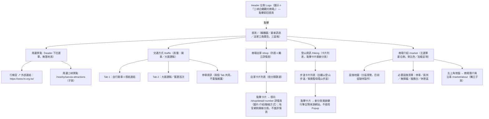

# 網站架構（Sitemap）

> 對應總覽文件：[01-網站總覽與目標](01-網站總覽與目標.md)

## 1. 架構圖



> 「首頁」不放在主選單文字項目裡——回首頁是靠 Header 左側的 Logo（圖示＋文字）點擊完成，主選單的 5 個項目（交通方式／商場店家／周邊景點／登山資訊／商場介紹）都是首頁以外的內容。
> 「行脩宮」不再是站內頁面，header 選單中的「周邊景點」點開後直接列出行脩宮官網的外部連結與「周邊三峽景點」這個子頁，本身不設 Hub 落地頁。「商場店家」為「列表頁（`/shop`）＋點擊卡片導向獨立詳情頁（`/shop/detail/:number`）」的互動模式（2026-10-05 架構調整，原規劃為 Popup／Modal、路由不變，已改為獨立路由；店家資料改放共用的 `shop.service.ts`，列表頁與詳情頁元件共用同一份資料）；「登山資訊」則是「列表頁＋點擊卡片直接開新分頁連到步道資料來源網站（如健行筆記）」，本站不維護步道詳情內容，兩者做法不同，不要混用。

## 2. 路由對照表（供前端開發參考，Angular Route）

| 頁面 | 路由 Path | 類型 | renderMode 建議 |
|---|---|---|---|
| 首頁（輪播圖／最新訊息／店家工商廣告） | `/` | 靜態＋少量動態 | Prerender，最新訊息與工商廣告區塊可用 Client 水合 |
| 交通方式（頁籤：開車／大眾運輸） | `/traffic` | 靜態，頁籤為頁面內狀態切換 | Prerender |
| 商場店家（列表） | `/shop` | 靜態（分類 enum 與店家清單寫在共用的 `shop.service.ts` 內） | Prerender |
| 商場店家詳情（`officialWebsite` 為空的店家點擊卡片導向） | `/shop/detail/:number` | 靜態，`:number` 對應店家 `number` 欄位值，與列表頁共用同一份 `shop.service.ts` 資料 | Prerender |
| 周邊三峽景點 | `/nearby/sanxia-attractions` | 靜態 | Prerender |
| 登山資訊（卡片列表，點擊卡片開新分頁） | `/hiking` | 靜態（步道清單寫在頁面 `.ts` 內），卡片點擊直接連到外部來源網站，無站內詳情 state | Prerender |
| 商場介紹 | `/market` | 靜態 | Prerender |
| 商場簡介與沿革（`/market` 左上角按鈕進入的獨立子頁） | `/market/about` | 靜態 | Prerender |

> 行脩宮不佔用站內路由，header 選單直接連到 `https://www.ht.org.tw/`（開新分頁）。
> **商場店家改用 `/shop/detail/:number` 明細路由**（2026-10-05 架構調整，原規劃為 Popup／Modal、不切換路由，已改為獨立路由）——點擊卡片導向詳情頁，瀏覽器可直接上一頁／分享單一店家網址；代價是「返回列表」時需要額外處理恢復原本的捲動位置與篩選狀態（`type` 查詢參數），不像 Popup 那樣天生不會遺失列表 state，實作上建議搭配 Angular Router 的 `RouteReuseStrategy` 或在共用 service 內暫存篩選狀態（見 [03-頁面內容規格](03-頁面內容規格.md) 商場店家一節）。
> 登山資訊**不設** `/hiking/baisanshan-trail`、`/hiking/baiji-ziwei-trail` 這類明細路由，做法與商場店家不同——點擊卡片**直接開新分頁連到步道的外部資料來源網站**（如健行筆記），不是站內詳情頁，因為步道里程／路況這類資訊變動頻繁，交給專業登山資料網站維護比站內重複建置更可靠。
> 商場店家目前分類 enum 與店家清單都直接寫在共用的 `shop.service.ts` 內（靜態資料，列表頁與詳情頁元件共用），沿用 `**` 的 `Prerender` 設定即可；日後若改接 CMS／後端 API，再評估是否改為 `RenderMode.Server`。

## 3. 導覽（Navigation）建議

**Header 結構：左側 Logo（回首頁）＋右側主選單（5 項，商場介紹最右側對比色凸顯）：**

```
[圖示 三峽白雞觀光商場]          交通方式 | 商場店家 | 周邊景點 ▾ | 登山資訊 | 商場介紹
         │                                          │
      點擊回首頁                          ├─ 行脩宮 ↗（外部連結，新分頁開啟）
                                          └─ 周邊三峽景點（站內子頁）
```

- **Logo 即首頁連結**：Header 左側的「三峽白雞觀光商場」（圖示＋文字）本身就是可點擊的連結，點下去就回首頁。主選單**不**另外放一個「首頁」文字項目，避免兩個入口做同一件事。
- **商場介紹**放在選單最右側，並維持對比色／加粗樣式，是全站使用頻率最高的入口。
- **周邊景點**是純下拉選單，點擊本身不導向任何落地頁；下拉內只有兩個選項，一個是外部連結（行脩宮），一個是站內子頁（周邊三峽景點）。外部連結需明確標示「↗」或等效圖示，並在新分頁開啟，避免使用者誤以為還留在本站。
- **登山資訊**、**商場店家**維持單一入口連結（不是下拉選單），不需要選單層級；進去之後商場店家是「列表＋點擊卡片導向獨立詳情頁 `/shop/detail/:number`」，登山資訊則是列表＋點擊卡片開新分頁連到外部來源網站。
- **交通方式**維持單一入口連結，進去之後在頁面內以頁籤（開車／大眾運輸）切換內容。

**頁尾（Footer，資訊彙整）：**

| 欄位 | 內容 |
|---|---|
| 商場資訊 | 地址、電話、營業時間 |
| 快速連結 | 交通方式、商場店家、周邊三峽景點、登山資訊 |
| 聯絡我們 | Email（目前唯一欄位，日後可視需要擴充電話／社群媒體連結） |

## 4. 全站貫穿元件

- **Tab 元件**：交通方式頁使用，之後若有其他頁面需要「同頁切換內容」也可重複使用。
- **List + Detail 元件**：商場店家列表卡片 → 點擊導向獨立詳情頁 `/shop/detail/:number`，返回列表時恢復捲動位置與篩選狀態；店家資料由共用的 `shop.service.ts` 提供給列表頁與詳情頁兩個元件。登山資訊不使用此模式（見下方說明）。
- **外部連結標示**：任何連到站外網站的連結（例如行脩宮、登山資訊的步道卡片、周邊三峽景點的「導航」「外部連結」按鈕）都應有一致的視覺標示（圖示＋`target="_blank"`），讓使用者清楚知道會離開本站。
- 周邊三峽景點的卡片下方內建「導航」（Google 地圖）與「外部連結」按鈕；登山資訊的卡片本身即為外部連結（點擊直接開新分頁連到健行筆記等來源網站），兩頁皆不經過站內詳情頁或 Popup。
