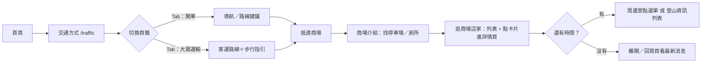
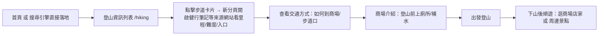
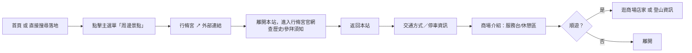
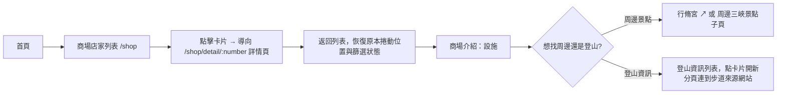

# UI Flow 與使用者情境

> 對應文件：[02-網站架構(Sitemap)](02-網站架構(Sitemap).md)、[03-頁面內容規格](03-頁面內容規格.md)
> 視覺化版本（含手繪 SVG 流程圖）已發佈為 Artifact，連結見對話紀錄。

## 情境一：第一次自駕前往的遊客

**關鍵設計意涵**：「開車／大眾運輸」是同一頁內的頁籤切換，不是兩個路由——交通方式頁必須在使用者「出發前」就把停車資訊講清楚（放在頁籤下方的共用區塊），否則使用者會在商場介紹頁與交通方式頁之間來回找答案。

---

## 情境二：以登山健行為主要目的的遊客

**關鍵設計意涵**：登山客通常直接從 Google 搜尋「白雞山步道」落地，不會先經過首頁——搜尋引擎能收錄並直接帶使用者到的落地頁就是「登山資訊列表」本身。由於步道詳情（里程／難度／路況）不在站內維護，而是點擊卡片直接開新分頁連到健行筆記等專業來源網站，列表頁的簡述要寫得足夠吸引人，讓使用者願意點進去看完整資訊，但不需要在站內重複呈現精確數據。

---

## 情境三：以行脩宮參拜為主要目的的信眾

**關鍵設計意涵**：行脩宮的歷史、參拜須知等內容完全由官方網站負責，本站不重複維護。使用者會有一次「離開再回來」的過程，因此交通方式／商場介紹頁面的內容必須完整到讓使用者不需要再回頭查行脩宮官網的資訊（例如：不要假設使用者記得官網上寫的開放時間）。

---

## 情境四：單純想逛商場、順便了解周邊的一般遊客

---

## 關鍵 UX 原則彙整

1. **商場店家詳情是獨立路由，不是 Popup**（2026-10-05 架構調整）：`/shop/detail/:number` 為獨立頁面，非彈出視窗；從詳情頁返回列表時要恢復原本的捲動位置與篩選狀態，不能重新整理或重置列表。店家資料透過共用的 `shop.service.ts` 讓列表頁與詳情頁共用同一份資料。登山資訊不經過站內詳情頁，卡片點擊直接開新分頁連到外部來源網站。
2. **頁籤不等於新頁面**：交通方式的「開車／大眾運輸」是同頁切換，停車資訊放在頁籤外的共用區塊，不重複維護兩份。
3. **外部連結要明顯標示**：行脩宮連到官方網站，必須有清楚的圖示（如 ↗）並開新分頁，讓使用者知道自己離開了本站。
4. **主選單用對比色取代常駐 CTA**：不另設「導航到商場」按鈕，改把「商場介紹」（放在選單最右側）用對比色／加粗凸顯；實際導航需求留在交通方式／商場介紹頁面內文處理。
5. **停車／交通資訊只維護一份**：商場介紹與交通方式頁互相連結，避免兩邊資料不同步。
6. **周邊景點與登山資訊維持兩個平行入口**：周邊景點是純下拉選單（行脩宮外部連結＋周邊三峽景點子頁），登山資訊是獨立的列表頁，兩者不合併，讓參拜／順遊與登山兩種需求各自直達。
7. **店家頁面現在只是骨架**：列表頁與詳情頁元件先建好，店家資料集中放在共用的 `shop.service.ts`（已有 10 筆 mock 假資料），資料日後從 mock 換成真實資料即可直接上線，不應重構頁面結構。登山資訊頁已有兩筆真實步道資料（健行筆記來源），資料結構已定案。
8. **最新消息與聯絡資訊先輕量化**：最新消息併入首頁的「最新訊息」區塊，聯絡資訊併入頁尾（Footer 僅 Email 欄位），兩者都不設獨立路由。
9. **回首頁靠 Logo，不是選單項目**：Header 左側的「三峽白雞觀光商場」Logo（圖示＋文字）本身就是首頁連結，主選單 5 個項目（交通方式／商場店家／周邊景點／登山資訊／商場介紹）都不含「首頁」，避免兩個入口做同一件事。
10. **首頁三個區塊各司其職**：輪播圖負責第一眼的視覺與活動導流，最新訊息負責即時公告，店家工商廣告負責導流到商場店家——三者不要互相取代內容。
